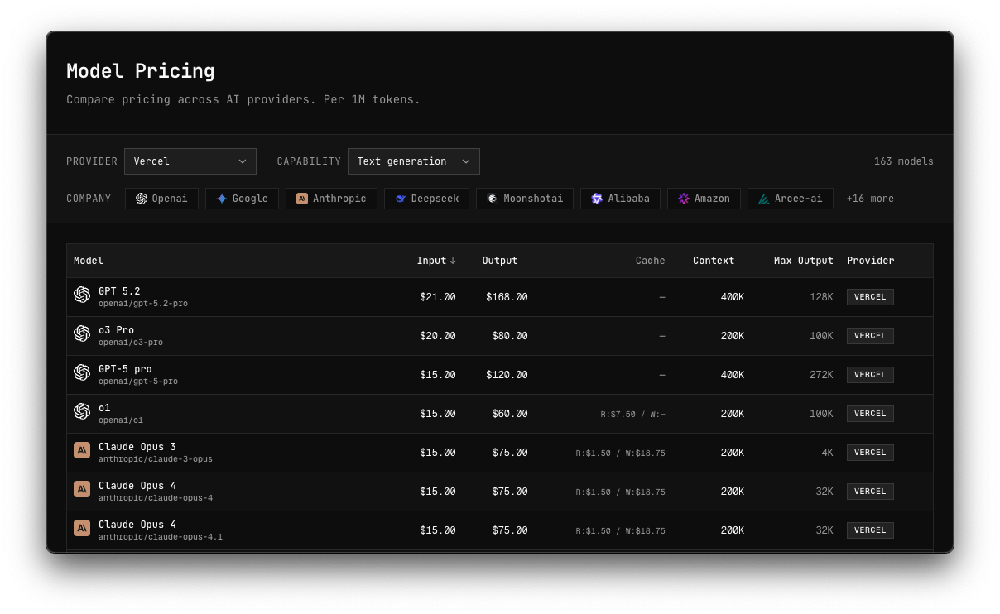

<h1 align="center">Model Price Compare</h1>

<p align="center">
  Quickly compare pricing across different AI providers · <a href="https://llm-prices.7gorbachevm.workers.dev">llm-prices.7gorbachevm.workers.dev</a>
</p>

<p align="center">
  
</p>

## Why?

[OpenRouter](https://openrouter.ai/models) and [models.dev](https://models.dev/) list hundreds of models, making it hard to quickly compare pricing. This app lets you filter and sort so you can decide at a glance whether to go with a frontier model or a mid-tier reasoning one.

## Features

- Filter by provider, company, and output modality (text, image, audio, video)
- Sort by input/output price, context window, or max output
- Copyable model IDs on hover, Vercel AI Gateway ready
- Auto-excludes utility models (embeddings, reranking, moderation) from text view
- Always up-to-date pricing fetched from the [models.dev HTTP API](https://models.dev/api.json)

## Stack

TanStack Start, Cloudflare Workers, shadcn/ui, and [tokenlens](https://github.com/nichochar/tokenlens) for pricing data.

## Development

```bash
pnpm install
pnpm dev
```

Run `pnpm typecheck` and `pnpm build` before deploying.

## Deployment

The Cloudflare Worker is configured as `llm-prices`.

```bash
pnpm run deploy
```
